# Global Clearing FIX Demo

A high-fidelity simulation of a post-trade clearing workflow using the FIX 4.4 protocol. This project demonstrates the separation of concerns between a **Clearing House** (Acceptor) and a **Member Firm** (Initiator), running as distinct Spring Boot processes.

## Architecture Overveiw

The system consists of two independent processes communicating via QuickFIX/J:

1.  **Clearing House (Port 8080):** Acts as the Central Counterparty (CCP). It receives trade allocations, updates a shared ledger, and sends acceptance reports.
2.  **Member Firm (Port 8081):** Represents a trading participant. It allows users to submit trades via a web interface, which are then transmitted to the Clearing House via FIX.

### Message Flow


## Architecture

```mermaid
graph TD
    subgraph "User Interface"
        User("👤 User")
    end

    subgraph "Member Firm Application"
        direction LR
        A["MemberFirmController(/submit-trade)"]
        B[TradeService]
        C["MemberInitiator(FIX Client)"]
        D[Member Database]
        
        A -- HTTP POST --> B;
        B -- sends message --> C;
        B -- persists local report --> D;
    end
    
    subgraph "Clearing House Application"
        direction LR
        E["ClearingAcceptor<br>(FIX Server)"]
        F[TradeService]
        G[TradeRepository & FixReportRepository]
        H[Clearing Database]
        I["ClearingHouseController<br>(/trades)"]
        
        E -- receives message --> F;
        F -- saves entities --> G;
        G -- persists data --> H;
        I -- fetches data --> G;
    end

    subgraph "Admin Interface"
        Admin("👤 Clearing House User")
    end

    User -- Submits Trade --> A;
    C -- FIX Protocol over TCP/IP --> E;
    Admin -- Views Trades --> I;
```



## UI Screenshots


## Tech Stack

- **Java 21**
- **Spring Boot 3.2.4**
- **QuickFIX/J 2.3.1** (FIX Engine)
- **Spring Data JPA & H2** (Persistent Storage with concurrent access)
- **Thymeleaf & Bootstrap 5** (Web Branding)
- **Actuator & Prometheus** (Observability)

## Getting Started

### Prerequisites

- Java 21+
- Maven 3.8+

### 1. Build the Project

```bash
mvn clean compile
```

### 2. Start the Clearing House (Process 1)

The Clearing House must be started first to accept the FIX connection.

```bash
mvn spring-boot:run -Dstart-class=com.global.demo.ClearingHouseApp
```
- **Web UI:** [http://localhost:8080](http://localhost:8080)
- **FIX Port:** 9876 (Acceptor)

### 3. Start the Member Firm (Process 2)

In a separate terminal:

```bash
mvn spring-boot:run -Dstart-class=com.global.demo.MemberFirmApp
```
- **Web UI:** [http://localhost:8081/member](http://localhost:8081/member)
- **FIX Port:** Dynamic (Initiator)

## Deployment

For production-like environments, you can use Docker or Kubernetes.

### 1. Docker Compose
The easiest way to run the entire system is using Docker Compose:

```bash
# Build and start all services
docker compose up -d --build
```
- **Clearing House:** [http://localhost:8080](http://localhost:8080)
- **Member Firm:** [http://localhost:8081/member](http://localhost:8081/member)

### 2. Kubernetes
Deployment manifests are provided in the `k8s/` directory.

#### Image Management
Before deploying, make the image accessible to your cluster:

**Remote Clusters:**
```bash
docker tag clearing-fix-demo:latest <your-registry>/clearing-fix-demo:latest
docker push <your-registry>/clearing-fix-demo:latest
```

**Local Clusters (e.g., Minikube):**
```bash
minikube image load clearing-fix-demo:latest
```

#### Deploy
Apply the manifests:
```bash
kubectl apply -f k8s/
```

Access the services:
- **Acceptor:** `kubectl port-forward service/fix-acceptor 8080:8080 9876:9876`
- **Initiator:** `kubectl port-forward deployment/fix-initiator 8081:8081`

## Configuration

- **Data Dictionary:** Custom FIX 4.4 dictionary located at `src/main/resources/FIX44.xml`.
- **Profiles:**
    - `acceptor`: Activates Central Counterparty logic and ledger UI.
    - `initiator`: Activates Trading Firm logic and submission UI.
- **Database:** Uses independent H2 instances for isolation: `clearing_db` (Acceptor) and `member_db` (Initiator), both located in the `./target/` directory.

## Features

- **Branded UI:** Modern Bootstrap 5 interface with "Global Clear Credit" branding.
- **Real-time Ledger:** View incoming trades and their clearing status.
- **Detailed FIX Reports:** Track `AllocationReport` messages with side, quantity, and status details.
- **Concurrent Processes:** Realistic simulation of two separate entities communicating over the network.
