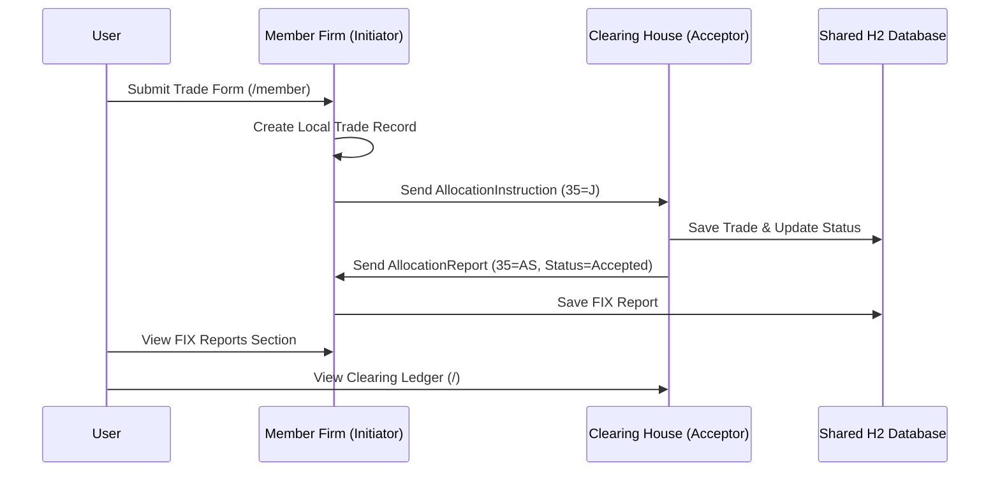

# Global Clearing FIX Demo

A high-fidelity simulation of a post-trade clearing workflow using the FIX 4.4 protocol. This project demonstrates the separation of concerns between a **Clearing House** (Acceptor) and a **Member Firm** (Initiator), running as distinct Spring Boot processes.

## Architecture Overveiw

The system consists of two independent processes communicating via QuickFIX/J:

1.  **Clearing House (Port 8080):** Acts as the Central Counterparty (CCP). It receives trade allocations, updates a shared ledger, and sends acceptance reports.
2.  **Member Firm (Port 8081):** Represents a trading participant. It allows users to submit trades via a web interface, which are then transmitted to the Clearing House via FIX.

### Message Flow



## Tech Stack

- **Java 17**
- **Spring Boot 3.2.4**
- **QuickFIX/J 2.3.1** (FIX Engine)
- **Spring Data JPA & H2** (Persistent Storage with concurrent access)
- **Thymeleaf & Bootstrap 5** (Web Branding)
- **Actuator & Prometheus** (Observability)

## Getting Started

### Prerequisites

- Java 17+
- Maven 3.8+

### 1. Build the Project

```bash
mvn clean compile
```

### 2. Start the Clearing House (Process 1)

The Clearing House must be started first to accept the FIX connection.

```bash
mvn spring-boot:run -Dstart-class=com.global.demo.ClearingHouseApp
```
- **Web UI:** [http://localhost:8080](http://localhost:8080)
- **FIX Port:** 9876 (Acceptor)

### 3. Start the Member Firm (Process 2)

In a separate terminal:

```bash
mvn spring-boot:run -Dstart-class=com.global.demo.MemberFirmApp
```
- **Web UI:** [http://localhost:8081/member](http://localhost:8081/member)
- **FIX Port:** Dynamic (Initiator)

## Configuration

- **Data Dictionary:** Custom FIX 4.4 dictionary located at `src/main/resources/FIX44.xml`.
- **Profiles:**
    - `acceptor`: Activates Central Counterparty logic and ledger UI.
    - `initiator`: Activates Trading Firm logic and submission UI.
- **Database:** Uses H2 file-based storage at `./target/clearingdb`. Concurrent access is enabled via `;AUTO_SERVER=TRUE`.

## Features

- **Branded UI:** Modern Bootstrap 5 interface with "Global Clear Credit" branding.
- **Real-time Ledger:** View incoming trades and their clearing status.
- **Detailed FIX Reports:** Track `AllocationReport` messages with side, quantity, and status details.
- **Concurrent Processes:** Realistic simulation of two separate entities communicating over the network.
